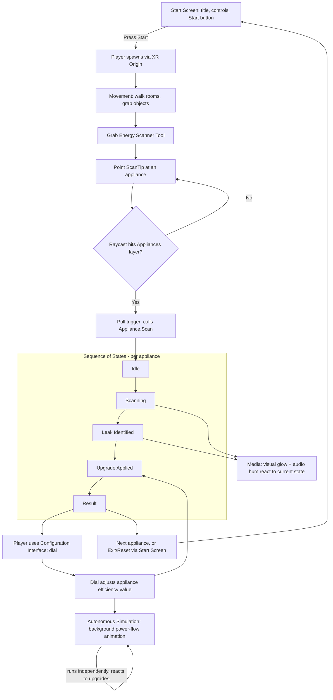

# Home Energy Debugger — Feature Overview & Architecture

Reference doc mapping each SIT283 required-functionality criterion to what it actually
does in this project, plus a diagram of how the systems connect.

## Feature Table

| # | Criterion | What it does in Home Energy Debugger | How it's built | Script(s) | Status |
|---|-----------|----------------------------------------|-----------------|-----------|--------|
| 1 | Movement | Player walks between the 4 rooms and grabs objects (scanner, dial) | XR Origin (XR Rig) continuous move/turn + XR Grab Interactable, from Starter Assets | Built-in XRI components | Done |
| 2 | Sequence of States | Each appliance runs through a diagnostic sequence: Idle to Scanning to Leak Identified to Upgrade Applied to Result | State machine pattern (enum/switch or state classes) living on the appliance itself | `ScannableAppliance.cs` | Next up |
| 3 | Tool | Handheld energy scanner: point at an appliance, pull trigger, get a power-draw reading | Raycast from a tool tip against an "Appliances" layer mask, tool delegates to the target's own component (mirrors Week 5 Scalpel pattern) | `EnergyScannerTool.cs`, `ScannableAppliance.cs` | In progress |
| 4 | Media | Visual cue (glow/particle/colour change) and audio hum react live to scan results and state changes | Triggered from inside the appliance's state machine transitions, not the tool | Hooks inside `ScannableAppliance.cs` (+ a MediaResponder component) | Planned |
| 5 | Configuration Interface | A dial/lever the player grabs and rotates to adjust insulation or storage capacity, with a visible effect on the appliance | Grabbable object exposing a float (0 to 1), read by the appliance to change its leak/efficiency behaviour | `ConfigDial.cs` | Planned |
| 6 | Autonomous Simulation | Background power-flow animation running on its own, independent of the player, that speeds up/slows down once an upgrade is applied | Looping animation or particle system driven by a shared "house power state", polled or event-driven from appliance upgrades | `PowerFlowSimulator.cs` | Planned |
| 7 | Start Screen | Title, purpose, controls, author name, Start button, Exit/Reset that returns the house to its unscanned state | UI Canvas (world-space, since this is VR) with buttons wired to scene state reset | `StartScreenController.cs` | Planned |

## System Architecture

How the pieces connect during play:

Read this as: the Start Screen gates entry and exit. Once inside, Movement and the Tool
are how the player interacts with the world at all. The Tool's only job is detecting an
appliance and calling into it — the appliance itself owns its State Machine, and Media
is just a side effect of that state machine changing, not something the tool controls
directly. The Configuration Interface feeds back into the same appliance, which is also
what the Autonomous Simulation reacts to, keeping all 7 criteria genuinely connected
rather than 7 disconnected demos bolted together.

If VS Code's Markdown Preview isn't rendering the Mermaid block (webview issues), any
Mermaid live editor (mermaid.live) or GitHub itself will render this fine — paste the
code block in if needed.
